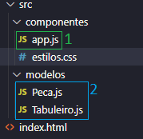
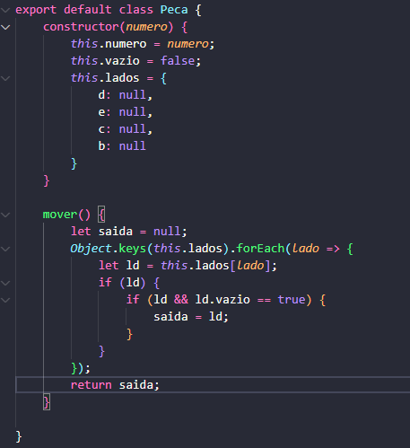
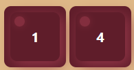
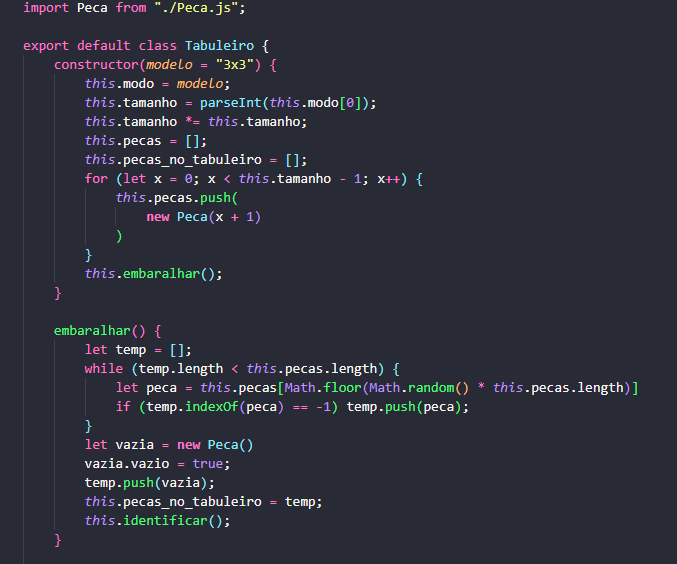
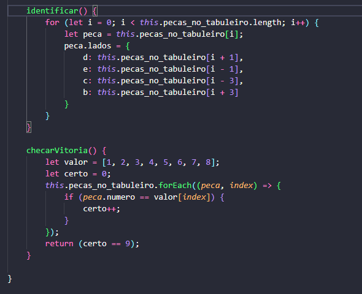
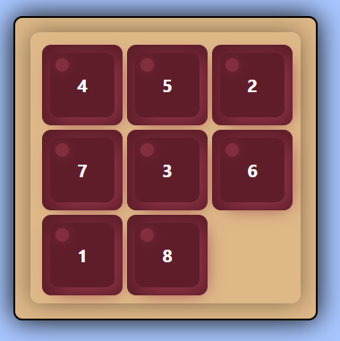

# Jogo Dos 8
### construido com JavaScript

> O Jogo dos Oito é um jogo de tabuleiro é estruturado em um tabuleiro 3×3 com 8 peças, cada peça tem um número de 1 a 8, e um espaço vazio. O objetivo é colocar os números nas peças para combinar com a configuração final usando o espaço vazio. Podemos deslizar quatro peças adjacentes (esquerda, direita, acima e abaixo) no espaço vazio.

 

## [clique aqui para jogar](https://stefanluks.github.io/Jogo-Dos-8-JavaScript/)

 

### Estrutura do Projeto

Componentes do projeto como aplicação em javaScript que controla o sistema e os modelos onde estão os objetos do jogo.

## __Elementos do Projeto__
## __1__ - Arquivo do que controla o sistema e manipula o DOM.
## __2__ - Arquivos modelos, os objetos do sistema.

 
 

# Objetos

__PEÇA:__ modelo do item que se move no tabuleiro e armazena um número.

>atributos: número (valor inteiro), vazio (bolean) e lados (um objeto do javascript que aponta para outras peças).

## Código

### Exemplo da Peça na Interface:

                       

# Tabuleiro

__PEÇA:__ modelo do item base que armazena as peças, controla seus movimentos e verifica os acertos do jogador.

>atributos: modo (string padrão "3x3"), vazio (bolean) e lados (um objeto do javascript que aponta para outras peças).

## Código

 

### Exemplo do Tabuleiro na Interface
 
